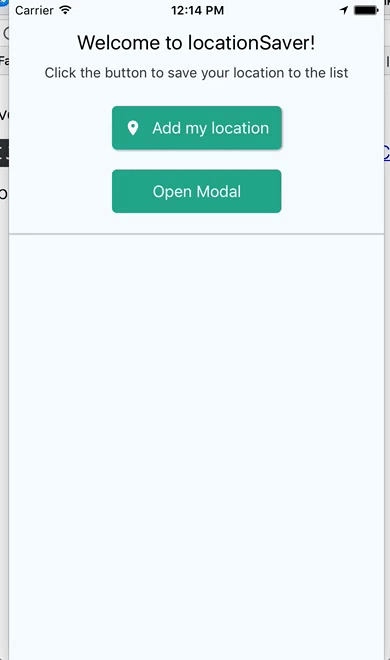
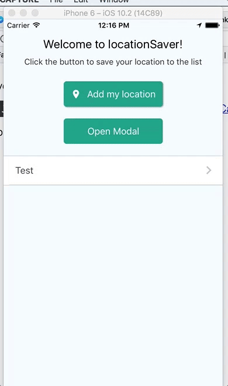

# Maps LocationSaver

Você pode adicionar seu próprio local à lista
(Também é possível renomear e excluir)

Em seguida, você pode navegar até esse local clicando em um item da lista
Se você tiver o gmaps ou o citymapper instalados, será perguntado com qual deles deseja abrir as direções

Você também pode adicionar sua localização à lista com a ajuda de um mapa e um marcador

